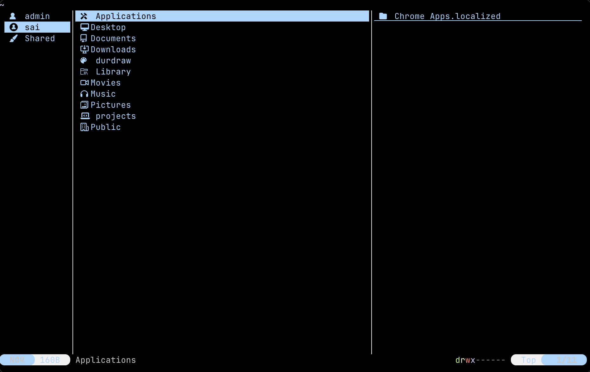

<div align="center">
  
</div>

<h3 align="center">
	iterm2 Dark Flavor for <a href="https://github.com/sxyazi/yazi">Yazi</a>
</h3>

## 👀 Preview



## 🎨 Installation

```bash
ya pkg  ArchLang/iterm2-dark
```

## ⚙️ Usage

Add the these lines to your `theme.toml` configuration file to use it:

```toml
[flavor]
dark = "iterm2-dark"
```
## ✨ Inspiration
This project is a fork from `kmlupreti's ayu dark theme`

## 📝 To do 
Need to change ththeme.xml file from `kmlupreti's ayu dark theme` to `match iterm2 dark theme`

## 📜 License

The flavor is MIT-licensed, and the included tmTheme is also MIT-licensed.

Check the [LICENSE](LICENSE) and [LICENSE-tmtheme](LICENSE-tmtheme) file for more details.
